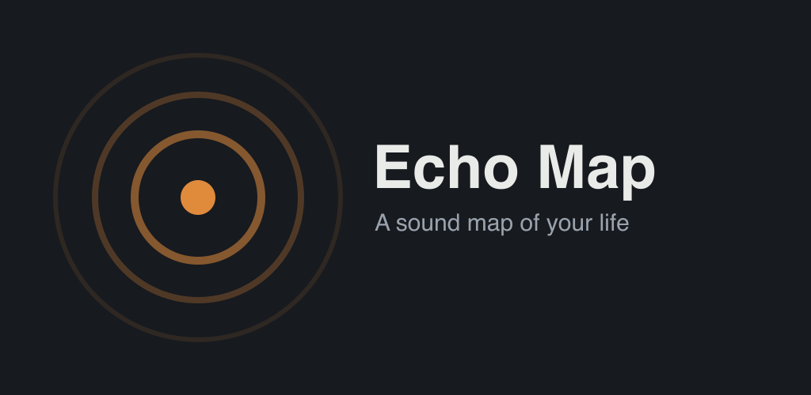

# 🌍 Echo Map

> A sound map of your life. Record the ambient sounds of meaningful places,
> pin them to a map, and hear them again years later.



Echo Map lets you capture short ambient recordings — a café's hum, waves on a
beach, a street musician — and pin them to where they happened. Open the map
later and tap a pin to relive the moment through sound. Not photos. Sound.

## Features

- 🎙️ One-tap recording with live, sound-reactive rings and a scrubbable waveform
- 🗺️ Geotagged sound pins on a custom slate map
- 🌍 Animated 3D globe on launch, lit by your memories
- 📜 Chronological timeline — "three years ago" does the emotional work
- 🌓 Light & dark · 🌐 English & Türkçe
- 🔒 Local-first — your sounds stay on your device (optional cloud backup)

## Tech

React Native (Expo · SDK 56) · TypeScript · React Three Fiber · React Native
Skia · Mapbox · expo-audio · SQLite (Drizzle) · Reanimated · i18next

## Run on a device

The app uses native modules (Mapbox, Skia, R3F/GL, audio, MMKV), so it runs in a
[development build](https://docs.expo.dev/develop/development-builds/introduction/),
**not** Expo Go.

```bash
npm install
cp .env.example .env        # add your Mapbox tokens (see below)
npm run android             # builds, installs, and starts on a connected device/emulator
```

- Requires **JDK 17 or 21** for the Android build (Gradle 9 doesn't support 25).
- `.env` needs `EXPO_PUBLIC_MAPBOX_TOKEN` (public `pk.`) for the map and
  `MAPBOX_DOWNLOAD_TOKEN` (secret `sk.` with `DOWNLOADS:READ`) for the native
  build. Without a token the app runs but the map shows a configuration notice.
- `npm run db:generate` regenerates Drizzle migrations after a schema change.

## Launch

Store and compliance material lives in [`docs/`](docs/) and
[`store-assets/`](store-assets/):

- [`docs/launch-checklist.md`](docs/launch-checklist.md) — Play readiness
- [`docs/privacy-policy.md`](docs/privacy-policy.md) · [`docs/data-safety.md`](docs/data-safety.md) · [`docs/accessibility.md`](docs/accessibility.md)
- [`store-assets/listing-copy.md`](store-assets/listing-copy.md) — TR + EN listing
- [`docs/supabase-setup.sql`](docs/supabase-setup.sql) — optional cloud backup schema + RLS

## Privacy

Recordings are stored locally on your device by default. Cloud backup is opt-in.
Location is used only while recording, never in the background.

## License

MIT
